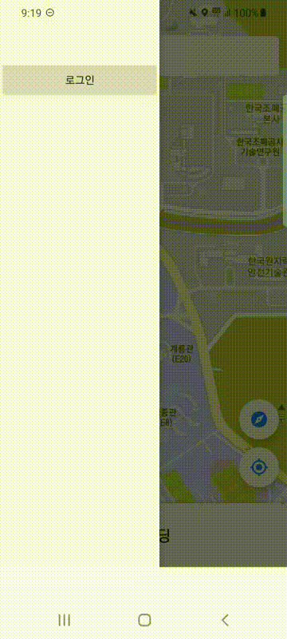
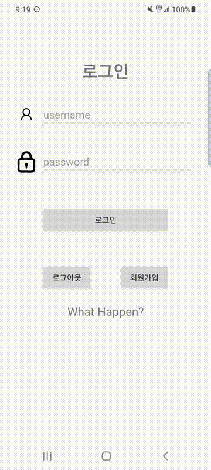
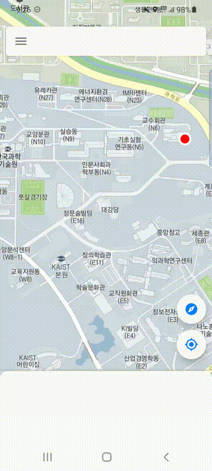
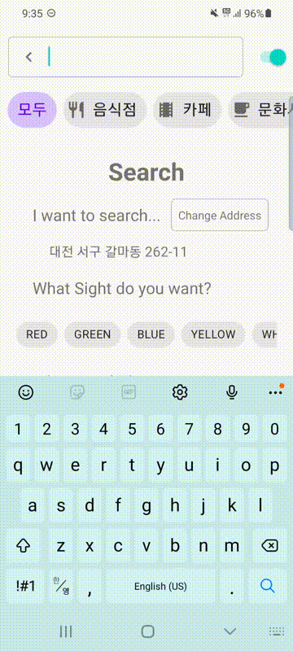
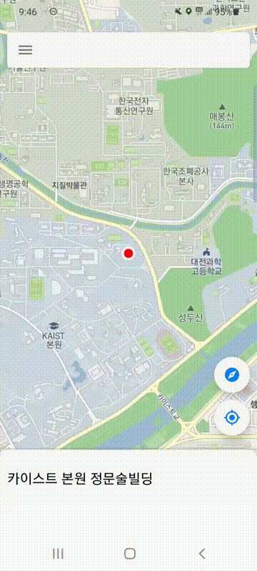

Assignment 2 week   
==============================
몰입캠프 2주차 프로젝트입니다.   
   
## 0. Project Name   
### 3-sense Map   
reviewing the world only use 3-sense   
   
## 1. Member
- Jeon SeungYoon   
- Kim DongHwi   
   
## 2. Tools which used
- Client : App which made by "Android Studio"   
- Server : Backend server which made by "Django"   

## 3. Applications
4만 개의 단어 중 3단어의 조합으로 주소를 나타내는 주소 체계 "[W3W](https://what3words.com/%EB%B9%84%ED%96%89.%EC%A4%91%EC%A7%80.%ED%8B%B0%EC%8A%88)"에서 아이디어를 착안해      
각종 식당이나 카페, 시설 등을 오로지 3가지의 단어로만 리뷰해 등록하는 어플을 제작했습니다.       

## 4. Member Account
<p>
    
    
</p>
<p></p>
어플을 사용하기 위해서는 회원가입이 필요합니다.      

Django의 회원 관리 라이브러리인 "rest-auth"를 사용해 구현했습니다.       
인증 방식은 rest-framework의 Token Authorization이며, 토큰의 기간은 없습니다.       

로그인 후 받아온 토큰 키를 header에 넣어 쉽게 인증할 수 있습니다.          

```python
    # settings.py
    INSTALLED_APPS = [
        '...',
        'rest_framework',
        'rest_framework.authtoken',
        'rest_auth',
        'django.contrib.sites',
        'allauth',
        'allauth.account',
        'rest_auth.registration',
        'allauth.socialaccount',
        'allauth.socialaccount.providers.naver'
    ]

    REST_FRAMEWORK = {
        'DEFAULT_PERMISSION_CLASSES' : (
            'rest_framework.permissions.IsAuthenticated',
        ),
        'DEFAULT_AUTHENTICATION_CLASSES': (
            'rest_framework.authentication.TokenAuthentication',
        ), 
    }
    REST_AUTH_SERIALIZERS = {
    'TOKEN_SERIALIZER': 'accounts.serializer.TokenSerializer',
    }
```
다음과 같이 settings.py를 지정하여 rest-framework로 구성된 Sign-up/Login endpoint를 만들 수 있습니다.       

## 5. Post reviews
방문한 곳에 대한 리뷰는 3개의 단어로 이루어져 있습니다.     
그러나 사용자에게 원할한 리뷰와 정보 제공을 위해       
단어 선택에서 제한을 두고 있습니다.      
<p>
    
    
</p>
<p></p>
선택 가능한 단어는 감각 표현입니다.       
시각 - 촉각 - 미각 으로 이루어져있으며       
후각과 청각은 많은 선택지를 주지 못할 것으로 생각해 제외했습니다.      

입력한 정보는 서버의 백엔드로 전송되어 저장되며       
db의 model 구성은 다음과 같습니다.     

```python
    # reviews/models.py
    class Area(models.Model):
        city = models.CharField(max_length=20)
        county = models.CharField(max_length=20)
        last = models.CharField(max_length=40)

    class Review(models.Model):
        area = models.ForeignKey(Area, on_delete=models.CASCADE)
        sight = models.IntegerField(choices=SightType.choices)
        touch = models.IntegerField(choices=TouchType.choices)
        taste = models.IntegerField(choices=TasteType.choices)
```

하나의 지역은 여러 개의 리뷰를 가질 수 있기 때문에        
1대 n 를 구현 가능한 ForeignKey를 사용했습니다.      

이 때문에 serializer를 통해 자동으로 만들어지는 create() 함수를       
override 해 새로 정의할 필요가 있었습니다.       

```python
    # reviews\serializer.py

    def create(self, validated_data):
        area_data = validated_data.pop('area')
        if not Area.objects.filter(
                city = area_data['city']
            ).filter(
                county = area_data['county']
            ).filter(
                last = area_data['last']
            ).exists() :
            area = Area.objects.create(**area_data)
        else:
            area = Area.objects.get(city = area_data['city'], county = area_data['county'], last = area_data['last'])

        validated_data['area'] = area
        review = Review.objects.create(**validated_data)

        return review
```

## 6. Sense Search
<p>
    
    
</p>
<p></p>
요청한 감각 선택에 따라 현재의 위치 주위에 있는 지역을 추천합니다.          
기반이 되는 데이터는 사용자가 올린 리뷰들이며          
각 지역별로 가장 많은 선택을 받은 감각들이 그 지역을 나타내는 감각이 됩니다.       

이를 계산 하기 위해 Django의 ORM 대신 custom한 sql문을 사용했으며       
의도한 대로 결과를 낼 수 있습니다.       

[이 링크](https://github.com/BUYA-GH/madcamp2/blob/master/Server1/reviews/views.py)에서 정확한 동작을 확인할 수 있습니다.       

## 7. Map View
<p>
    
    
</p>
<p></p>
카카오 지도 SDK 를 이용해 지도 기능을 구현하였습니다.           

현재 제공되는 기능으로는 건물명 검색, 이미지 검색, 현재 위치 추적, 나침반 모드, 키워드 검색이 있습니다.           
앱을 처음 실행하면 현재 위치로 카메라가 이동합니다.              

화면을 길게 누르면 맵에 마커가 표시되고, 마커의 위치가 좌표 객체의 형태로 저장됩니다.                 
좌표 객체에서 주소 문자열을 받아온 후 상호명을 얻어 표시되게 하였습니다.         

상호명과 관련된 이미지 검색은 다음 검색 REST API로 구현했습니다.                
키워드로 검색 기능은 MapView 상단 검색 바를 클릭하면 이용할 수 있습니다.              
검색하고자 하는 키워드를 입력하면 카카오 로컬 REST API 에서 연관순으로 검색 결과를 RecyclerView로 보여줍니다.             
RecyclerView item 을 클릭하면 해당 item 의 지도상 좌표를 MapView 에 표시합니다.            

## 8. License
```
    Copyright [2021] [BUYA-GH, qsenn]

    Licensed under the Apache License, Version 2.0 (the "License");
    you may not use this file except in compliance with the License.
    You may obtain a copy of the License at

    http://www.apache.org/licenses/LICENSE-2.0

    Unless required by applicable law or agreed to in writing, software
    distributed under the License is distributed on an "AS IS" BASIS,
    WITHOUT WARRANTIES OR CONDITIONS OF ANY KIND, either express or implied.
    See the License for the specific language governing permissions and
    limitations under the License.
```
